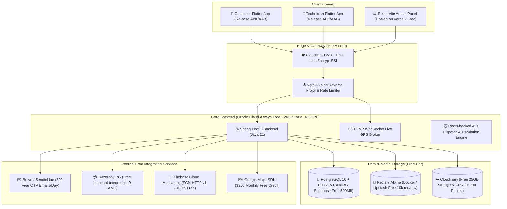
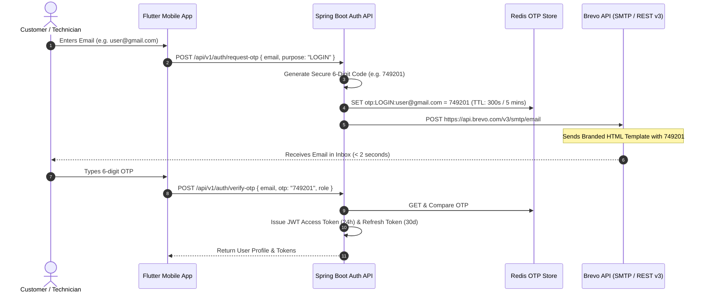
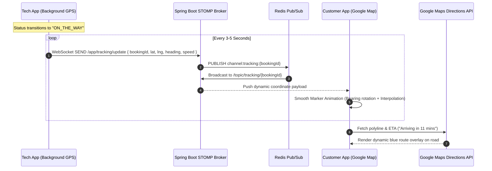
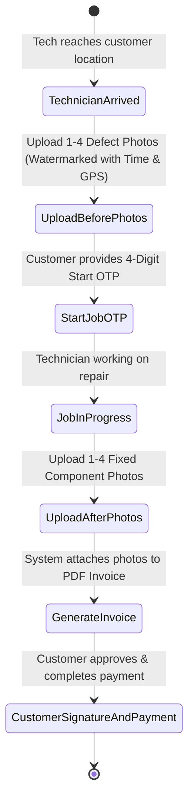
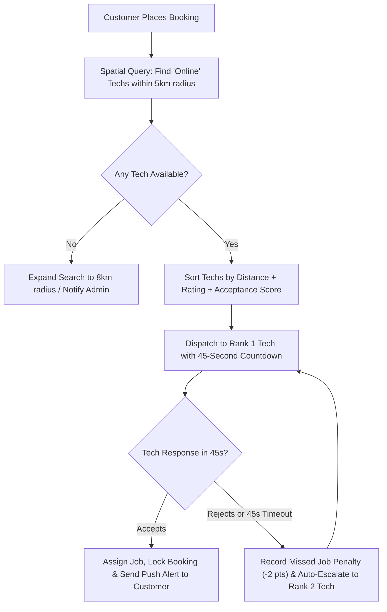
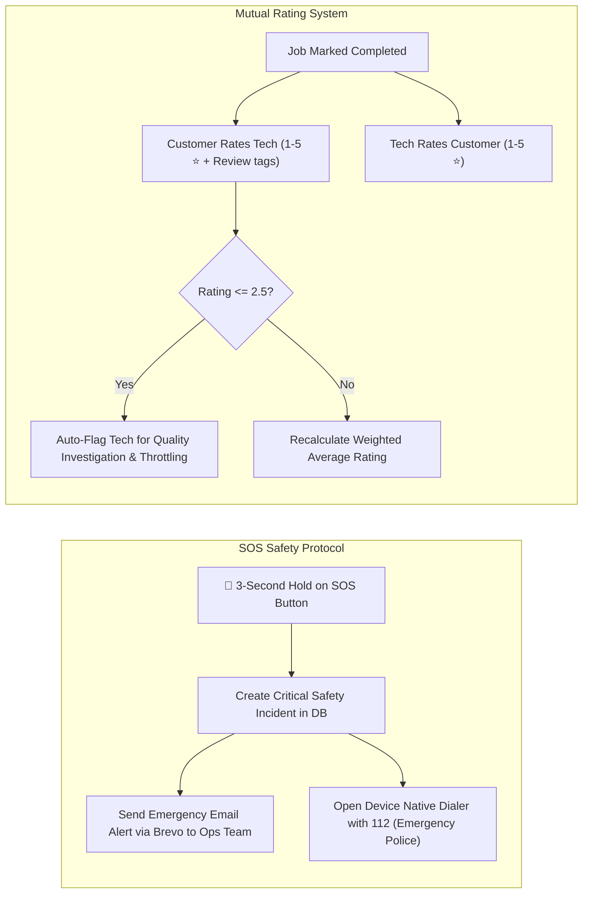
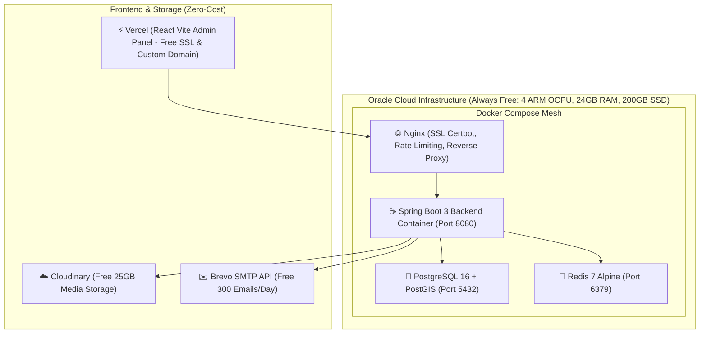

# 🛠️ BookUrTechnician: Complete 100% Free Production Implementation Chart

This production architecture blueprint is designed to run the entire **BookUrTechnician** ecosystem at **₹0 / $0 Cost** using permanent free-tier cloud platforms, **Brevo Email OTP (300 free emails/day)**, Razorpay PG & Wallet Ledger, STOMP WebSockets for Live GPS Tracking, Cloudinary Media CDN, and Oracle Cloud Always Free VM.

---

## 🏛️ 100% Zero-Cost Production Stack Overview



---

## 📋 Comprehensive 7-Pillar Production Roadmap

---

### 1️⃣ Authentication: Brevo (Sendinblue) Email OTP Engine (300 Free Emails/Day)

* **Why Brevo?** 
  * 100% Free: **300 transactional emails per day** with 99.8% inbox delivery.
  * No expensive mobile SMS DLT registration or recurring SMS gateway charges.
  * Beautiful responsive HTML OTP email with 6-digit verification code.



#### Brevo Email OTP Service Blueprint:
* Endpoint: `https://api.brevo.com/v3/smtp/email`
* Header: `api-key: ${BREVO_API_KEY}`
* Payload:
```json
{
  "sender": { "name": "BookUrTechnician Support", "email": "auth@bookurtechnician.com" },
  "to": [{ "email": "customer@example.com" }],
  "subject": "749201 is your BookUrTechnician Verification Code",
  "htmlContent": "<div style='font-family: Arial; padding: 20px; background: #f8fafc;'><div style='max-width: 480px; margin: auto; background: white; border-radius: 12px; padding: 28px; border: 1px solid #e2e8f0;'><h2 style='color: #0f172a; margin-top: 0;'>BookUrTechnician</h2><p style='color: #475569; font-size: 15px;'>Your one-time verification code is:</p><div style='font-size: 32px; font-weight: 800; letter-spacing: 6px; color: #2563eb; padding: 16px; background: #eff6ff; border-radius: 8px; text-align: center; margin: 20px 0;'>749201</div><p style='color: #94a3b8; font-size: 13px;'>Valid for 5 minutes. If you did not request this, please ignore.</p></div></div>"
}
```

---

### 2️⃣ Payment Gateway, Technician Wallet & Automatic Payouts

```mermaid
graph TD
    subgraph "Customer Payment"
        PAY_REQ["Customer Books Service"] --> CHOOSE_PAY{"Payment Mode"}
        CHOOSE_PAY -- "Online (UPI / Card / NetBanking)" --> RZP_ORDER["Create Razorpay Order (POST /api/v1/payments/create-order)"]
        RZP_ORDER --> RZP_MODAL["Customer Completes Payment on Razorpay"]
        RZP_MODAL --> WEBHOOK["Webhook /api/v1/payments/webhook verifies HMAC SHA-256"]
        WEBHOOK --> SET_PAID["Mark Booking as PAID & Lock Funds in Escrow"]
        CHOOSE_PAY -- "Cash on Delivery (COD)" --> COD_SET["Mark Booking as COD_PENDING"]
    end

    subgraph "Job Completion & Technician Wallet Settlement"
        JOB_END["Technician Completes Job (Total: ₹1,000)"]
        JOB_END --> CALC["Commission Engine: 15% Platform Fee (₹150), 85% Tech Share (₹850)"]
        CALC --> LEDGER["Update TechnicianWallet Ledger: +₹850"]
        LEDGER --> CHECK_BALANCE{"Tech Wallet Balance"}
        CHECK_BALANCE -- "Balance < -₹200 (Negative COD dues)" --> BLOCK_TECH["🚫 Block Tech from receiving new bookings until recharged"]
        CHECK_BALANCE -- "Balance >= ₹500 & Auto-Payout Enabled" --> PAYOUT["Trigger Instant RazorpayX Payout to Tech UPI VPA"]
    end
```



#### Key Technical Rules:
1. **Idempotent Webhooks**: All webhook events (`payment.captured`, `payment.failed`, `refund.processed`) store transaction IDs in Redis with a 24-hour TTL to prevent double-crediting.
2. **Platform Commission Deduction**:
   - For Online Payments: Platform retains 15% immediately, remaining 85% is credited to the technician's wallet.
   - For COD Payments: Technician collects 100% cash from the customer; the system debits the 15% platform commission from the technician's wallet balance.
3. **Minimum Wallet Balance Enforcer**:
   - If a technician's wallet balance falls below `-₹200` (due to unpaid COD commissions), their status is automatically switched from `ONLINE` to `SUSPENDED_UNPAID_DUES`.

---

### 3️⃣ Live GPS Tracking & Google Maps Polylines



#### Key Technical Deliverables:
1. **Background GPS Ping (`flutter_background_service`)**:
   - Runs battery-optimized GPS updates only when an active job is in `ON_THE_WAY` status.
2. **WebSocket STOMP Broker (Spring Boot)**:
   - Topic: `/topic/tracking/{bookingId}`
   - Latency: `< 80ms` for real-time smooth marker movement.

---

### 4️⃣ Proof of Work: Job Before & After Photos (Cloudinary Free 25GB)



#### Storage Strategy (100% Free):
- **Cloudinary Free Tier**: 25 GB storage & bandwidth per month.
- **Client-Side Compression**: Flutter app compresses images to `.webp` (max 400KB each) before upload to save bandwidth and storage.

---

### 5️⃣ Intelligent Dispatch & 45-Second Siren Escalation Engine



#### Technician Alarm Trigger:
- Uses **FCM v1 High-Priority Data Messages** combined with `flutter_local_notifications`.
- Plays loud loop siren (`siren_alarm.mp3`) with continuous vibration and full-screen notification banner until accepted or timed out.

---

### 6️⃣ Customer Support, SOS Emergency & Mutual Rating System



---

### 7️⃣ 100% Free Production Cloud Deployment (Oracle Cloud Always Free)



#### Production Docker Compose Specification (`docker-compose.prod.yml`):
```yaml
version: '3.8'

services:
  nginx:
    image: nginx:alpine
    container_name: bt-nginx
    ports:
      - "80:80"
      - "443:443"
    volumes:
      - ./nginx/conf.d:/etc/nginx/conf.d
      - ./certbot/conf:/etc/letsencrypt
      - ./certbot/www:/var/www/certbot
    depends_on:
      - backend
    restart: always

  backend:
    build:
      context: ./apps/backend
      dockerfile: Dockerfile
    container_name: bt-backend
    environment:
      - SPRING_PROFILES_ACTIVE=prod
      - DB_URL=jdbc:postgresql://postgres:5432/bookurtechnician
      - DB_USER=postgres
      - DB_PASSWORD=${DB_PASSWORD}
      - REDIS_HOST=redis
      - REDIS_PORT=6379
      - JWT_SECRET=${JWT_SECRET}
      - BREVO_API_KEY=${BREVO_API_KEY}
      - BREVO_SENDER_EMAIL=auth@bookurtechnician.com
      - RAZORPAY_KEY_ID=${RAZORPAY_KEY_ID}
      - RAZORPAY_KEY_SECRET=${RAZORPAY_KEY_SECRET}
      - CLOUDINARY_URL=${CLOUDINARY_URL}
    depends_on:
      - postgres
      - redis
    restart: always

  postgres:
    image: postgis/postgis:16-3.4-alpine
    container_name: bt-postgres
    environment:
      POSTGRES_DB: bookurtechnician
      POSTGRES_USER: postgres
      POSTGRES_PASSWORD: ${DB_PASSWORD}
    volumes:
      - postgres_data:/var/lib/postgresql/data
    restart: always

  redis:
    image: redis:7-alpine
    container_name: bt-redis
    volumes:
      - redis_data:/data
    restart: always

volumes:
  postgres_data:
  redis_data:
```

---

## 🎯 Implementation Phases & Rollout Plan

| Phase | Module | Key Deliverables |
| :--- | :--- | :--- |
| **Phase 1** | **Brevo Email OTP Service** | Configured `BrevoEmailService` in Spring Boot, HTML OTP template, 5-min Redis TTL, zero phone SMS cost |
| **Phase 2** | **Payment & Wallet Engine** | Razorpay PG Order API, Webhook signature verification, Technician Wallet ledger, auto-commission cut & negative balance blocking |
| **Phase 3** | **Live GPS Tracking & Maps** | STOMP WebSocket endpoints, Redis PubSub live tracking, Google Maps smooth marker & polyline routing in Flutter |
| **Phase 4** | **45s Dispatch & Siren Alerts** | PostGIS radius search, Redis 45s countdown timer, FCM v1 high-priority siren alarm on technician phone |
| **Phase 5** | **Proof of Work & Safety** | Before/After photo uploads to Cloudinary, SOS emergency broadcast, 2-way rating engine |
| **Phase 6** | **Zero-Cost Production Deploy** | Oracle Cloud Always Free VM setup, Docker Compose deployment, Let's Encrypt SSL, Vercel React Admin live |

---

## 🔒 Verification & Testing Strategy
1. **Brevo OTP Deliverability Test**: Send test OTPs to Gmail, Outlook, Yahoo to verify < 3 second delivery and spam score 0.
2. **Razorpay Webhook Test**: Simulate webhook events with invalid vs valid signatures to guarantee zero fraud.
3. **GPS Stress Test**: Stream 50 concurrent GPS location updates over WebSockets to ensure server CPU remains < 10% on free tier.
4. **End-to-End Booking Flow**: Customer Book $\rightarrow$ 45s Siren on Tech App $\rightarrow$ Accept $\rightarrow$ Live Track $\rightarrow$ Before Photos $\rightarrow$ Start OTP $\rightarrow$ After Photos $\rightarrow$ Razorpay Payment $\rightarrow$ Wallet Split.
